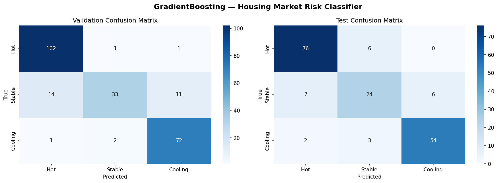
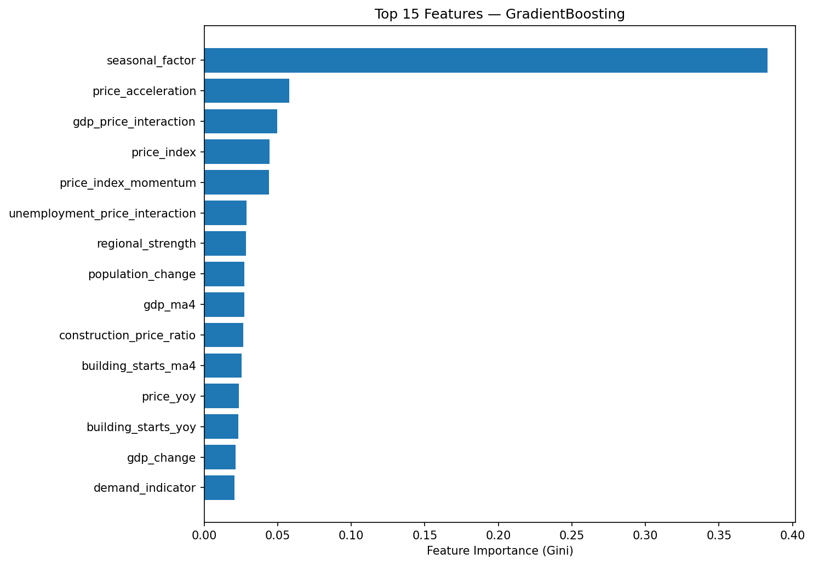

# HousingMarketClassifier

A machine learning classifier that predicts Norwegian housing market risk (Hot / Stable / Cooling) across 15 counties using macroeconomic data from Statistics Norway (SSB).

## Approach

I started by building a **Random Forest classifier from scratch** — implementing decision tree construction with Gini impurity, bootstrap sampling, and majority voting — to understand the fundamentals. The initial model trained on a small manually downloaded dataset (80 samples, 5 regions, 2020–2023) achieved 67% validation accuracy and couldn't predict the "Stable" class at all.

To improve, I built an **automated SSB API data pipeline** (`fetch_ssb_data.py`) that fetches 10 statistical tables programmatically, covering 2005–2024 across all 15 Norwegian counties. This expanded the dataset to **1,200 samples with 35 engineered features** derived from house prices, CPI, unemployment, GDP, building permits, mortgage rates, population growth, and household income.

With the larger dataset, I pivoted to **scikit-learn's ensemble classifiers**, comparing `RandomForestClassifier` (with balanced class weights) against `GradientBoostingClassifier`. Gradient Boosting won on macro-F1 and became the final model.

[Claude Opus 4.6](https://www.anthropic.com/claude) was used as a development tool throughout the project.

## Results

| Metric | Validation | Test |
|--------|-----------|------|
| Accuracy | 87.3% | 86.5% |
| Macro F1 | 0.844 | 0.834 |

Per-class test performance:

| Class | Precision | Recall | F1 |
|-------|-----------|--------|-----|
| Hot | 0.89 | 0.93 | 0.91 |
| Stable | 0.73 | 0.65 | 0.69 |
| Cooling | 0.90 | 0.92 | 0.91 |

### Confusion Matrix



### Feature Importance



Top features: seasonal quarter factor, price acceleration, GDP-price interaction, price index level, price momentum, unemployment-price interaction, and regional strength.

## Data Sources

All data fetched automatically from the [SSB Statistikkbanken API](https://www.ssb.no/api/):

| SSB Table | Feature | Frequency | Coverage |
|-----------|---------|-----------|----------|
| 03013 | Consumer Price Index (CPI) | Monthly | 2005–2025 |
| 10701 | Norges Bank policy rate | Monthly | 2014–2026 |
| 01222 | Population change by county | Quarterly | 2005–2024 |
| 07221 | House price index by region | Quarterly | 2005–2024 |
| 10187 | Property sales volume | Quarterly | 2008–2024 |
| 13760 | Unemployment rate | Monthly | 2006–2026 |
| 03723 | Building starts by county | Monthly | 2005–2026 |
| 10748 | Mortgage interest rates | Monthly | 2014–2025 |
| 09171 | GDP volume change | Quarterly | 2005–2025 |
| 06944 | Household income by county | Annual | 2005–2023 |

## Pipeline

```
fetch_ssb_data.py  →  data_parser.py  →  enhanced_features.py  →  train_model.py
     (API)             (JSON→CSV)         (35 features)           (sklearn)
```

```bash
# Full pipeline (fetch + parse + train)
python run_complete_analysis.py

# Skip API fetch (use cached JSON)
python run_complete_analysis.py --skip-fetch
```

## Project Structure

```
├── fetch_ssb_data.py         # SSB API data fetcher (10 tables)
├── data_parser.py            # JSON-stat2 parser → unified CSV
├── enhanced_features.py      # Feature engineering & labeling
├── train_model.py            # Model training & evaluation (sklearn)
├── random_forest_classifier.py  # Original from-scratch RF (kept for reference)
├── backtest_strategy.py      # Trading strategy backtester
├── run_complete_analysis.py   # Pipeline orchestrator
├── processed/                 # Generated CSV output
└── *.json                     # Cached SSB data
```

## Requirements

```bash
pip install -r requirements.txt
```
