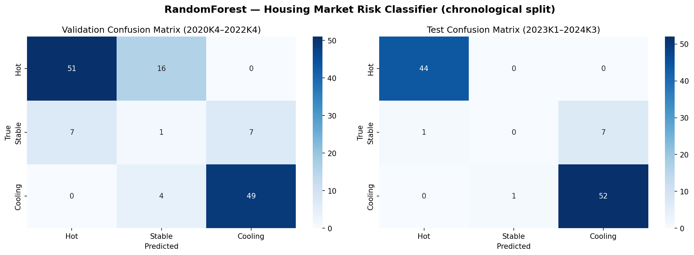
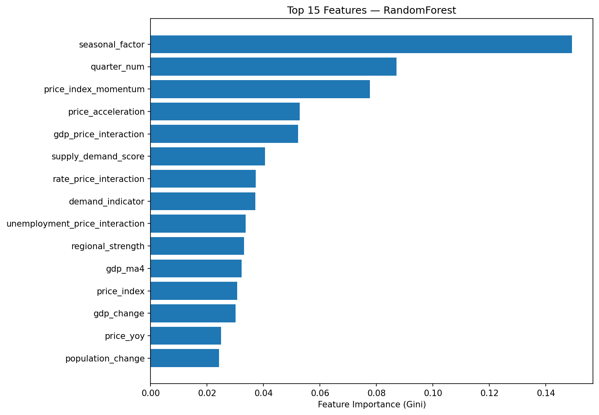

# HousingMarketClassifier

This project tries to predict where the Norwegian housing market is heading next quarter. For each of Norway's 15 counties, it labels the coming quarter as **Hot**, **Stable** or **Cooling**, using macroeconomic data from Statistics Norway (SSB).

The short version of the result: the model does not beat a simple seasonal baseline. Knowing which quarter of the year it is turns out to be about as useful as all 32 features combined. The details are in [Results](#results).

> Earlier versions of this README reported 86.5% test accuracy. That number came from a train/test split that leaked, and it has been retracted. See [The leakage bug](#the-leakage-bug).

## Contents

- [Getting started](#getting-started)
- [How it works](#how-it-works)
- [Results](#results)
- [The leakage bug](#the-leakage-bug)
- [Known limitations](#known-limitations)
- [Next steps](#next-steps)
- [Project structure](#project-structure)
- [Background](#background)

## Getting started

Install the dependencies:

```bash
pip install -r requirements.txt
```

Run the full pipeline (fetch from SSB, parse, train):

```bash
python run_complete_analysis.py
```

If you already have the JSON files in `data/`, you can skip the API calls:

```bash
python run_complete_analysis.py --skip-fetch
```

To train on the longer 2005+ panel instead (this drops the interest rate features, since they only start in 2014):

```bash
python src/train_model.py --min-year 2005
```

Every run writes its metrics to `output/results.json`, so the numbers in this README can always be checked against the code.

## How it works

### Pipeline

The project is four scripts run in sequence:

```
fetch_ssb_data.py  →  data_parser.py  →  enhanced_features.py  →  train_model.py
     (API)             (JSON to CSV)       (35 features)          (split, baselines, sklearn)
```

1. **Fetch.** `fetch_ssb_data.py` downloads 10 tables from the SSB API.
2. **Parse.** `data_parser.py` turns the JSON-stat2 responses into one table, `output/processed_data.csv`. It also handles the county reforms of 2020 and 2024 (more on that below).
3. **Features.** `enhanced_features.py` builds moving averages, momentum, regional strength and similar features, and creates the labels.
4. **Train.** `train_model.py` splits the data by quarter, computes baselines, trains the models and saves the plots.

### Data

All data comes from the [SSB Statistikkbanken API](https://www.ssb.no/api/):

| SSB table | What it measures | Frequency | Coverage |
|-----------|------------------|-----------|----------|
| 03013 | Consumer price index (CPI) | Monthly | 2005-2025 |
| 10701 | Norges Bank policy rate | Monthly | 2014-2026 |
| 01222 | Population change by county | Quarterly | 2005-2024 |
| 07221 | House price index by region | Quarterly | 2005-2024 |
| 10187 | Property sales volume | Quarterly | 2008-2024 |
| 13760 | Unemployment rate | Monthly | 2006-2026 |
| 03723 | Building starts by county | Monthly | 2005-2026 |
| 10748 | Mortgage interest rates | Monthly | 2014-2025 |
| 09171 | GDP volume change | Quarterly | 2005-2025 |
| 06944 | Household income by county | Annual | 2005-2023 |

Norway has redrawn its county map twice in this period. Viken was split into Østfold, Akershus and Buskerud, Vestfold og Telemark into Vestfold and Telemark, and Troms og Finnmark into Troms and Finnmark. A large part of `data_parser.py` maps all of this onto one consistent set of 15 modern counties, so each series means the same thing across the whole period.

### Labels

Each county-quarter is labelled by the price change in the **next** quarter. Features only use current and past data.

| Label | Next-quarter price change |
|-------|---------------------------|
| Hot | above +2.0% |
| Stable | between -0.5% and +2.0% |
| Cooling | below -0.5% |

### Models

The pipeline compares scikit-learn's `RandomForestClassifier` (with balanced class weights) and `GradientBoostingClassifier` against three simple baselines:

- **Majority class:** always predict the most common label.
- **Persistence:** repeat last quarter's label.
- **Seasonal lookup:** predict from the quarter of the year and nothing else.

## Results

The test set is 7 quarters that the model never saw during training (2023K1 to 2024K3). The full panel has 645 county-quarters from 2014 onward and 32 features.

| Model / baseline | Val macro-F1 | Test macro-F1 | Test accuracy |
|------------------|--------------|---------------|---------------|
| Majority class | 0.221 | 0.197 | 41.9% |
| Persistence | 0.322 | 0.357 | 44.8% |
| **Seasonal lookup** | **0.627** | **0.642** | **92.4%** |
| Random Forest | 0.590 | 0.639 | 91.4% |
| Gradient Boosting | 0.508 | n/a | n/a |

Only the model with the best validation score is evaluated on the test set, so Gradient Boosting has no test score.

### What this means

The Random Forest scores 0.003 macro-F1 below the seasonal lookup on the test set. A lookup table that only knows "which quarter of the year is it" matches the full model.

I think this is the honest result, and also the most interesting one. Norwegian house prices follow a strong yearly cycle. In the training window, 83% of Q1s are Hot and 77% of Q3s are Cooling. Since the label is next quarter's raw price change sorted into three bins, the calendar almost decides the answer by itself.

An ablation backs this up. Removing `seasonal_factor` and `quarter_num` drops the Random Forest to 0.555 test macro-F1. Nearly all of its apparent skill comes from seasonality, and the macroeconomic series add nothing on top of the calendar.

### Per-class performance

Random Forest on the test set:

| Class | Precision | Recall | F1 | Support |
|-------|-----------|--------|----|---------|
| Hot | 0.98 | 1.00 | 0.99 | 44 |
| Stable | 0.00 | 0.00 | 0.00 | 8 |
| Cooling | 0.88 | 0.98 | 0.93 | 53 |

The 91.4% accuracy looks better than it is. The model never predicts Stable, and Stable is only 8 of the 105 test rows, so missing all of them barely moves accuracy. Macro-F1 is the number to look at.

### Plots





The two most important features are `seasonal_factor` and `quarter_num`, which is the same finding showing up in the importances.

## The leakage bug

The original evaluation was wrong, and fixing it changed the conclusion of the project.

`create_labels` returned its data sorted by `['region', 'quarter']`. `train_model.py` then took the first 65% of rows as training data, under a comment that said `# Time-based split`. Since the rows were sorted by county name first, this actually split the data alphabetically by county, not by time:

| | Old (broken) split | New split |
|---|---|---|
| Train | Agder to Telemark, all years | 2014K1 to 2020K3 |
| Validation | Troms, Trøndelag, most of Vestfold | 2020K4 to 2022K4 |
| Test | Rest of Vestfold, Vestland, Østfold | 2023K1 to 2024K3 |

This leaked information in two ways:

1. **Shared labels.** The 15 counties map to only 10 SSB price regions. Buskerud, Telemark, Vestfold and Østfold share one price series, so their labels are identical every quarter. Most of the old test set had the same answer as a Buskerud or Telemark row the model had already trained on for that quarter.
2. **The same quarters in train and test.** All 79 quarters showed up in both sets. National series like CPI, the policy rate and GDP are unique per quarter, so together they work like a timestamp. The model could learn "2016K2 was Hot" from one county and reuse it for another.

The fix assigns whole quarters to each set. All counties for a given quarter land in the same set, and the model is only scored on quarters it has never seen.

Two related bugs were fixed at the same time:

- `rate_change`, `unemployment_change`, `mortgage_rate_change` and `gdp_ma4` used `.diff()` and `.rolling()` without grouping by region. On region-sorted data, the first row of each county was computed against the last row of the previous county. These are now grouped by region.
- `supply_demand_score` and `demand_indicator` were z-scored using statistics from the whole panel, test years included. They now use per-region expanding statistics, which only look at the past.

## Known limitations

- **15 counties, but only 10 price series.** SSB's price index (table 07221) covers 10 regions. Buskerud, Telemark, Vestfold and Østfold share one series, and Finnmark, Nordland and Troms share another, so those counties have identical labels. The effective sample is smaller than 645 rows suggests.
- **Only 2014 onward by default.** The policy rate and mortgage rate series start in 2014. The old code ran on 2005-2024 and filled missing values with `fillna(0)`, which told the model Norway had a 0% policy rate for a decade. That looked exactly like 2020, when the rate really was 0%. The default run now starts in 2014 and uses median imputation fitted on the training window only. With `--min-year 2005`, features with less than 70% coverage in the training window are dropped automatically instead of being filled with zeros.
- **Household income is dropped.** SSB table 06944 has no data for 7 of the 15 counties, so `household_income` and the affordability features built on it are removed by the coverage rule.
- **Small test set.** 7 quarters and 105 rows, with only 8 Stable rows. The Stable scores are indicative at best.
- **`backtest_strategy.py` was removed.** It referenced undefined variables and never actually ran. The leveraged "profit" and Sharpe ratios it computed from a price index were not meaningful anyway.

## Next steps

As the task is defined now, it is close to a seasonal lookup, which leaves the model very little room to show real skill. The most useful change would be a harder and more meaningful target: label on seasonally adjusted or year-over-year price changes instead of raw quarter-on-quarter changes. That removes the yearly cycle from the target, so the macroeconomic features would have to carry actual signal.

This changes what the project claims to predict, so I have left it as explicit future work instead of quietly swapping the label.

## Project structure

```
├── run_complete_analysis.py         # Entry point, runs the whole pipeline
├── src/
│   ├── fetch_ssb_data.py            # Fetches 10 tables from the SSB API
│   ├── data_parser.py               # JSON-stat2 parser and county harmonisation
│   ├── enhanced_features.py         # Feature engineering and labels
│   ├── train_model.py               # Chronological split, baselines, training
│   └── random_forest_classifier.py  # Original from-scratch Random Forest (reference)
├── data/                            # Cached SSB JSON responses
├── output/
│   ├── processed_data.csv
│   ├── results.json                 # Metrics from the latest run
│   ├── confusion_matrix.png
│   └── feature_importance.png
└── requirements.txt
```

## Background

I started by writing a Random Forest from scratch to learn how it works: decision trees built with Gini impurity, bootstrap sampling, random feature subsets and majority voting. That version (`src/random_forest_classifier.py`) trained on a small dataset I downloaded by hand, with 80 samples from 5 regions between 2020 and 2023. It reached 67% validation accuracy and could not predict Stable at all.

To get more data, I built the automated SSB pipeline, which expanded the dataset to all 15 counties from 2005 to 2024. With that much more data, I switched to scikit-learn's ensemble classifiers.

[Claude Opus 4.6](https://www.anthropic.com/claude) was used as a development tool throughout the project.
